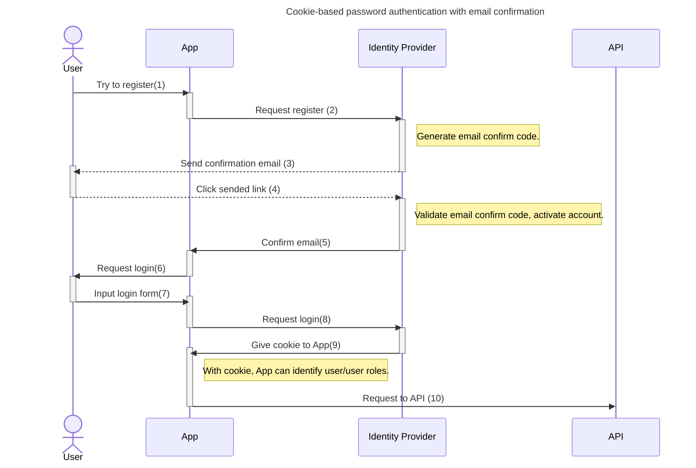

# Backend

## Setup (Only at first time)
We use [Send Grid](https://sendgrid.com/en-us/solutions/email-api) to send email, so need to create acount and get api key. To create account, please visit [here](https://www.twilio.com/en-us/blog/send-emails-using-the-sendgrid-api-with-dotnetnet-6-and-csharp#configuring-your-sendgrid-account-to-send-emails).


Once you create account, please make input.json by edditing [input.template.json](./input.template.json).


Last, you need to register input.json to secret manager. To start secret manager, run the following:
```
dotnet user-secrets init
```
You can register secrets to secret manager by:
```
cat ./input.json | dotnet user-secrets set
```

Reference:
- [tutorial](https://www.twilio.com/en-us/blog/send-emails-using-the-sendgrid-api-with-dotnetnet-6-and-csharp)
- [microsoft docs(Secret Manager)](https://learn.microsoft.com/ja-jp/aspnet/core/security/app-secrets?view=aspnetcore-9.0&tabs=linux)

## Run

To run Backend, 

```dotnet watch -lp https```

## Document generation 
[openapi-v1.json](./openapi-v1.json) is automatically generated by ```Microsoft.AspNetCore.OpenApi``` at build time.

Reference :
- [microsoft docs](https://learn.microsoft.com/ja-jp/aspnet/core/fundamentals/openapi/aspnetcore-openapi?view=aspnetcore-9.0&tabs=visual-studio)

## Swagger UI
We use [Swashbuckle](https://www.nuget.org/packages/swashbuckle.aspnetcore.swaggerui/) to generate Swagger UI. 
Please visit /swagger endpoint.

### Swashbuckle vs NSwag
The reason why Swashbuckle used is, document generation at build time by ```Microsoft.AspNetCore.OpenApi``` doesn't work with NSwag(I don't know what happens...), so Swashbuckle used instead as documented in [microsoft doc](https://learn.microsoft.com/ja-jp/aspnet/core/fundamentals/openapi/using-openapi-documents?view=aspnetcore-9.0).


Reference :
- [Swashbuckle vs NSwag](https://devlog.mescius.jp/asp-net-core-web-api-nswag/)

# API
## Identity
The below is the authentication diagram. We authenticate user by info endpoint prepared by Identity Provider.
Plus, we assume to allow any user can access API, i.e., use role just to control UI. Apparently it is not good in terms of security, but 
is enough to be used just for internal purpose.


# Data
## Migration 
```dotnet ef migrations add InitialCreate```
